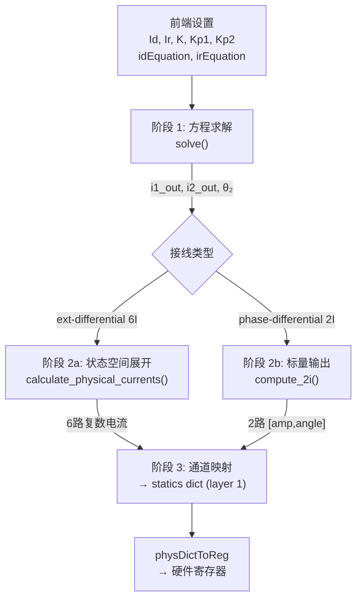

# 差动试验计算公式全流程文档

## 计算管线总览



---

## 前端输入参数

| 参数 | 来源 | 说明 |
|------|------|------|
| `Id` / `Ir` | `points[].x` / `points[].y` | 试验点坐标 |
| `K` | `equationSettings.kFactor` | 制动系数 |
| `Kp1` / `Kp2` | `equationSettings.kp1` / `kp2` | 变比/接线补偿系数 |
| `idEquation` | `equationSettings.idEquation` | 动作方程类型 |
| `irEquation` | `equationSettings.irEquation` | 制动方程类型 |
| `vectorGroupLetter1/2` | `protectionSettings` | 联结字母 (y/d) |
| `vectorGroupClock` | `protectionSettings` | 钟点数 (0~11) |
| `phaseCorrection` | `protectionSettings` | 相位校正 (none/y-side/delta-side) |
| `zeroSequenceCorrection` | `protectionSettings` | Y 侧零序校正 |
| `testPhase` | `projectSettings.testPhase` | 测试相别 (A/B/C/AB/BC/CA/ABC) |
| `i1Terminal` / `i2Terminal` | `connectionSettings` | 端子接线方式 |
| `i1Angle` / `i2Angle` | `connectionSettings` | 接线角度 (仅 2I) |

---

## 阶段 1: 方程求解 — `solve()`

> 代码: [diff.py#L70-L120](file:///home/pi/Desktop/Relay/RelayProtection/calc/diff.py#L70-L120)

### 输入 → 输出

```
输入: (Id, Ir, K, Kp1, Kp2, idEquation, irEquation)
输出: (i1_out, i2_out, θ₂)
```

### 步骤 1: 确定侧 2 基准相位

| `idEquation` | θ₂ |
|---|---|
| `id_sum`, `id_sum_sq` | **180°** |
| `id_diff`, `id_diff_sq`, `id_i1` | **0°** |

### 步骤 2: 路由求解 → 得到 i₁', i₂'

所有路由的**统一前提**：动作方程在标量层面化简为 `i₁' - i₂' = Id`

#### 路由 1: 直通型 (`id_i1`)

$$i_1' = I_d, \quad i_2' = I_r$$

#### 路由 2: 平方乘积型 (`id_sum_sq` / `id_diff_sq`)

$$i_1' - i_2' = \sqrt{I_d}, \quad i_1' \cdot i_2' = I_r$$

求解（令 $d = \sqrt{I_d}$）：

$$i_2' = \frac{-d + \sqrt{d^2 + 4 I_r}}{2}, \quad i_1' = d + i_2'$$

#### 路由 3: id_sum / id_diff → 按 irEquation 二级路由

**求解器 A — 和差型** (`ir_diff_k`, `ir_sum_k`, `ir_sum_div_k`, `ir_imax_sum_k`)

$$i_1' + i_2' = I_r \cdot K, \quad i_1' - i_2' = I_d$$

$$\boxed{i_1' = \frac{I_d + I_r \cdot K}{2}, \quad i_2' = \frac{I_r \cdot K - I_d}{2}}$$

**求解器 B — 最大值型** (`ir_max_k`)

$$\max(i_1', i_2') = I_r / K$$

$$i_1' = I_r / K, \quad i_2' = I_r / K - I_d$$

**求解器 C — 定值型** (`ir_i2_k`, `ir_id_abs_diff`)

$$i_2' = I_r / K, \quad i_1' = I_d + i_2'$$

**求解器 D — 乘积型** (`ir_sqrt_cos`)

$$i_1' \cdot i_2' = I_r^2, \quad i_1' - i_2' = I_d$$

$$i_2' = \frac{-I_d + \sqrt{I_d^2 + 4 I_r^2}}{2}, \quad i_1' = I_d + i_2'$$

### 步骤 3: 极性修正

若 $i_2' < 0$：

$$i_2' = |i_2'|, \quad \theta_2 = \begin{cases} 0° & \text{if } \theta_2 = 180° \\ 180° & \text{if } \theta_2 = 0° \end{cases}$$

### 步骤 4: Kp 补偿除法

$$\boxed{i_{1,out} = \frac{i_1'}{Kp_1}, \quad i_{2,out} = \frac{i_2'}{Kp_2}}$$

### 典型算例

> 设置: `id_sum` + `ir_diff_k`, K=2, Kp1=Kp2=1, Id=0.5, Ir=1.0

$$i_1' = \frac{0.5 + 1.0 \times 2}{2} = 1.25, \quad i_2' = \frac{1.0 \times 2 - 0.5}{2} = 0.75$$
$$\theta_2 = 180°, \quad i_{1,out} = 1.25/1 = 1.25, \quad i_{2,out} = 0.75/1 = 0.75$$

---

## 阶段 2a: 状态空间展开 (6I 模式) — `calculate_physical_currents()`

> 代码: [diff.py#L174-L242](file:///home/pi/Desktop/Relay/RelayProtection/calc/diff.py#L174-L242)

### 输入

```
(i1_out, i2_out, θ₂, testPhase, phaseCorrection, zeroSequenceCorrection, clock, l1Type, l2Type)
```

### 步骤 1: 建立内部目标向量

将标量电流映射到三相复数向量（相量形式）：

$$c_1 = i_{1,out} \angle 0°, \quad c_2 = i_{2,out} \angle \theta_2$$

| testPhase | 侧1 目标向量 $\vec{T}_1$ | 侧2 目标向量 $\vec{T}_2$ |
|-----------|---------------------------|---------------------------|
| A | $[c_1, 0, 0]$ | $[c_2, 0, 0]$ |
| B | $[0, c_1, 0]$ | $[0, c_2, 0]$ |
| C | $[0, 0, c_1]$ | $[0, 0, c_2]$ |
| AB | $[c_1, -c_1, 0]$ | $[c_2, -c_2, 0]$ |
| BC | $[0, c_1, -c_1]$ | $[0, c_2, -c_2]$ |
| CA | $[-c_1, 0, c_1]$ | $[-c_2, 0, c_2]$ |
| ABC | $[c_1, c_1 a^2, c_1 a]$ | $[c_2, c_2 a^2, c_2 a]$ |

其中 $a = e^{j120°}$, $a^2 = e^{-j120°}$

### 步骤 2: 确定两侧方程组类型

| phaseCorrection | 侧联结 | eq 类型 |
|---|---|---|
| `none` | 任意 | `"none"` |
| `y-side` | y | `"y-side"` |
| `y-side` | d | `"none"` |
| `delta-side` | d | `"delta-side"` |
| `delta-side` | y | `"none"` |

叠加零序校正：若 `zeroSequenceCorrection=true` 且 eq 仍为 `"none"` 且侧联结为 y → eq 设为 `"zsc"`

### 步骤 3: 钟点角差旋转

**仅当侧 2 无相位校正**（eq2 为 `"none"` 或 `"zsc"`）时，施加钟点角差：

$$\Delta\theta = (12 - \text{clock}) \times 30°$$
$$\vec{T}_2 = \vec{T}_2 \cdot e^{j \Delta\theta}$$

> 例：clock=11 → Δθ=30°，每个侧2相量旋转 +30°

### 步骤 4: Minimax 约束求解器

> 代码: [diff.py#L124-L172](file:///home/pi/Desktop/Relay/RelayProtection/calc/diff.py#L124-L172)

对每侧独立应用约束，将"保护内部目标电流"反算为"测试仪实际应发出的物理电流"。

#### 场景 1: `"none"` — 无校正

$$\vec{phys} = \vec{T}$$

#### 场景 2: `"zsc"` — Y 侧零序校正

保护内部公式: $I_{phys} - I_0 = I_{target}$

- **单相故障**：双通道对消法。故障相 = 目标值，耦合相 = -目标值，第三相 = 0

$$\text{例 A 相: } [I_a, -I_a, 0]$$

- **多相故障**：目标已自然消除零序，直接输出

#### 场景 3: `"y-side"` — Y 侧相位校正

保护内部公式: $(I_a - I_b) / \sqrt{3} = I'_a$

逆变换（满足 Minimax 约束的物理输出）：

$$I_a = \frac{T_a - T_c}{\sqrt{3}} \times m, \quad
I_b = \frac{T_b - T_a}{\sqrt{3}} \times m, \quad
I_c = \frac{T_c - T_b}{\sqrt{3}} \times m$$

其中 $m = 1.5$（单相故障）或 $m = 1.0$（多相故障）

#### 场景 4: `"delta-side"` — Δ 侧相位校正

保护内部公式: $(I_x - I_z) / \sqrt{3} = I'_x$

逆变换：

$$I_a = \frac{T_a - T_b}{\sqrt{3}} \times m, \quad
I_b = \frac{T_b - T_c}{\sqrt{3}} \times m, \quad
I_c = \frac{T_c - T_a}{\sqrt{3}} \times m$$

### 步骤 5: 复数 → [幅值, 相位°]

```python
for c in phys1 + phys2:
    amp = |c|
    angle = arg(c)°
    result.append([amp, angle])
```

### 典型算例 (续)

> Y/d-11, A相, 无校正

1. 目标向量: $\vec{T}_1 = [1.25\angle0°, 0, 0]$, $\vec{T}_2 = [0.75\angle180°, 0, 0]$
2. eq1 = eq2 = `"none"`
3. 钟点角差: $(12-11) \times 30° = 30°$ → $\vec{T}_2 = [0.75\angle210°, 0, 0]$
4. Minimax: 直通

**输出**:

| 通道 | 幅值 | 相位 |
|------|------|------|
| Ia | 1.25 A | 0° |
| Ib, Ic | 0 | - |
| Ix | 0.75 A | 210° (-150°) |
| Iy, Iz | 0 | - |

---

## 阶段 2b: 标量输出 (2I 模式) — `compute_2i()`

> 代码: [diff_bridge.py#L94-L150](file:///home/pi/Desktop/Relay/RelayProtection/calc/diff_bridge.py#L94-L150)

2I 模式**不做**三相展开，不使用 `calculate_physical_currents`。直接从 `solve()` 获取标量后处理。

### 步骤 1: 方程求解

同阶段 1，得到 `(i1_out, i2_out, θ₂)`

### 步骤 2: √3 乘数

根据 phaseCorrection 和联结字母，对被校正侧乘以 $\sqrt{3}$：

$$\text{需要乘} \sqrt{3} \iff \begin{cases} \text{phaseCorrection} = \text{y-side} \text{ 且 侧联结} = \text{y} \\ \text{phaseCorrection} = \text{delta-side} \text{ 且 侧联结} = \text{d} \end{cases}$$

| phaseCorrection | letter1 | letter2 | i1 ×√3? | i2 ×√3? |
|---|---|---|---|---|
| `none` | 任意 | 任意 | ✗ | ✗ |
| `y-side` | y | y | ✓ | ✓ |
| `y-side` | y | d | ✓ | ✗ |
| `delta-side` | y | d | ✗ | ✓ |
| `delta-side` | d | d | ✓ | ✓ |

### 步骤 3: 输出

$$\text{Side1} = [|i_{1,out}|, \quad \text{i1Angle}]$$
$$\text{Side2} = [|i_{2,out}|, \quad \text{i2Angle} + \theta_2]$$

> i2Angle 通常为 180°，加上 θ₂ 后归一化到 [-180°, 180°]

---

## 阶段 3: 通道映射

> 代码: [ApiDifferentialTest.py](file:///home/pi/Desktop/Relay/RelayProtection/api/ApiDifferentialTest.py#L30-L54)

### API 通道索引

| 索引 | 名称 | 类型 | HW 通道 (MapChannel) |
|------|------|------|-----|
| 0 | Ua | 电压 | 0 |
| 1 | Ub | 电压 | 2 |
| 2 | Uc | 电压 | 4 |
| 3 | Ux | 电压 | 6 |
| 4 | Uy | 电压 | 8 |
| 5 | Uz | 电压 | 10 |
| **6** | **Ia** | **电流** | **1** |
| **7** | **Ib** | **电流** | **3** |
| **8** | **Ic** | **电流** | **5** |
| **9** | **Ix** | **电流** | **7** |
| **10** | **Iy** | **电流** | **9** |
| **11** | **Iz** | **电流** | **11** |

### Layer 语义

| Layer | val1 | val2 | 校准函数 |
|-------|------|------|----------|
| **0** | 幅值 (DC 校准) | **频率 Hz** | `ConvertFreqToReg` |
| **≥1** | 幅值 (AC 校准) | **相位 °** | `ConvertPhaseToReg` |

> **所有电流数据写入 layer "1"**（幅值 + 相位），**不触碰** layer "0"（频率由 Node 0 初始化为 50Hz）

### 6I 端子映射

| i1Terminal / i2Terminal | 通道 |
|---|---|
| `high-y` | Ia(6), Ib(7), Ic(8) |
| `low-y` | Ix(9), Iy(10), Iz(11) |

`compute_6ch` 输出 `[ch0~ch5]`：

| i1Terminal | ch0→ | ch1→ | ch2→ | ch3→ | ch4→ | ch5→ |
|---|---|---|---|---|---|---|
| `high-y` (默认) | Ia(6) | Ib(7) | Ic(8) | Ix(9) | Iy(10) | Iz(11) |
| `low-y` | Ix(9) | Iy(10) | Iz(11) | Ia(6) | Ib(7) | Ic(8) |

### 2I 端子映射

每个端子选项 → 输出到一组通道，并联输出相同电流：

| 端子 | 通道 | 说明 |
|------|------|------|
| `ia` | [6] | 单通道 Ia |
| `iab` | [6, 7] | Ia + Ib 两并 |
| `iabc` | [6, 7, 8] | Ia + Ib + Ic 三并 |
| `ix` | [9] | 单通道 Ix |
| `ixy` | [9, 10] | Ix + Iy 两并 |
| `ixyz` | [9, 10, 11] | Ix + Iy + Iz 三并 |

### Statics 字典示例

```python
# 6I 模式, A相, Y/d-11, 无校正
statics = {
    # 电压通道 (前端下发，保持不变)
    "0": {"0": [0.0, 50.0], "1": [57.735, 0.0]},    # Ua
    "3": {"1": [57.735, -120.0]},                      # Ux
    # 电流通道 (后端计算，layer "1")
    "6":  {"1": [1.25, 0.0]},     # Ia = 1.25A ∠0°
    "7":  {"1": [0.0, 0.0]},      # Ib = 0
    "8":  {"1": [0.0, 0.0]},      # Ic = 0
    "9":  {"1": [0.75, -150.0]},  # Ix = 0.75A ∠-150°
    "10": {"1": [0.0, 0.0]},      # Iy = 0
    "11": {"1": [0.0, 0.0]},      # Iz = 0
}
```

### 数据流最终路径

```
statics dict (API 通道索引, 物理量)
       ↓ physDictToReg()
       ↓  └─ MapChannel(6) = HW 1 (Ia)
       ↓  └─ calib.PhysToReg(1, 1, 1.25, 0.0) → [amp_reg, phase_reg]
       ↓
reg dict (HW 通道索引, 寄存器值)
       ↓ _compileDictToFrames()
       ↓  └─ BuildParamFrame(DDS_WR_SHADOW, regIdx, chMask, amp_reg, phase_reg)
       ↓
硬件帧 → FPGA DDS
```
