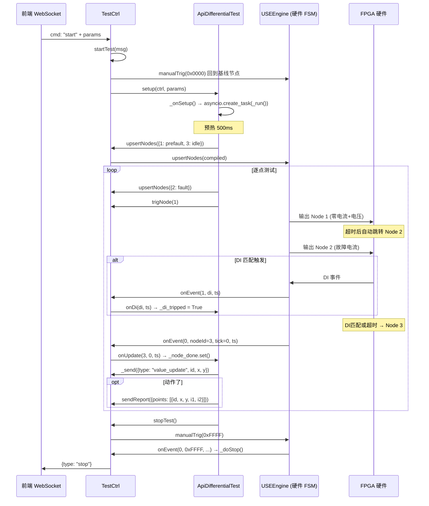
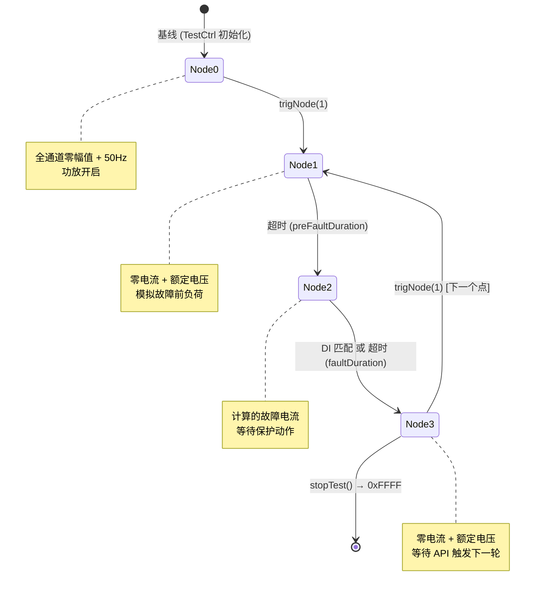

# 差动试验执行流程文档

本文档描述 `ApiDifferentialTest` 如何通过 `TestCtrl` 的接口函数实现完整的差动试验流程。

---

## 系统架构



---

## 调用的 TestCtrl 函数清单

### 1. `upsertNodes(apiNodes: Dict[int, ApiNodeData])` → bool

**作用**: 创建或更新 FSM 节点。

**内部流程**:
1. 将 `ApiNodeData` 通过 `_compileNode()` 编译为 `USENode`
2. `_compileNode` 内部调用 `_compileDictToFrames(n.base, DDS_WR_SHADOW)` 将寄存器字典编译为硬件帧序列
3. 传递给 `engine.upsertNodes()` 写入硬件 FSM

**差动试验中的用法**:

```python
# 预编译固定节点 (整个试验中不变)
nodes_fixed = {
    1: self._build_prefault_node(),   # Node 1: 零电流 + 超时→2
    3: self._build_idle_node(),       # Node 3: 零电流 + 挂起
}
self.ctrl.upsertNodes(nodes_fixed)

# 每个测试点动态更新 Node 2
fault_node = self._compute_and_build_fault(ir, id_val)
self.ctrl.upsertNodes({2: fault_node})
```

**ApiNodeData 字段说明**:

| 字段 | Node 1 (故障前) | Node 2 (故障态) | Node 3 (挂起) |
|------|----------------|----------------|---------------|
| `mode` | 1 (静态) | 1 (静态) | 1 (静态) |
| `base` | 零电流 + 电压 | 计算的故障电流 | 零电流 + 电压 |
| `timeoutMs` | preFaultDuration | faultDuration | — |
| `timeoutId` | 2 | 3 | — |
| `diMatchMask` | — | logicMask | — |
| `diMatchId` | — | 3 | — |

---

### 2. `trigNode(nodeId: int)` → bool

**作用**: 手动触发 FSM 跳转到指定节点。

**内部**: 调用 `engine.manualTrig(nodeId)`。

**差动试验中的用法**:

```python
# 开始测试：跳转到 Node 1 (如果有故障前) 或 Node 2
start_node = 1 if self._simulate_pre_fault else 2
self.ctrl.trigNode(start_node)
```

---

### 3. `_send(data: dict)`

**作用**: 通过 WebSocket 向前端发送消息。自动注入 `module` 字段。

**内部**:
```python
def _send(self, data: dict):
    if self._module:
        data["module"] = self._module   # "differential_test"
    asyncio.ensure_future(self._wsSend(data))
```

**差动试验中的用法**:

```python
# 发送实测轨迹点 (右图青色圆点)
self.ctrl._send({
    "type": "value_update",
    "id": pt_id,        # 点表行 ID
    "x": ir,             # 横轴 (制动电流)
    "y": round(id_val, 6) # 纵轴 (动作电流)
})
```

前端收到:
```json
{"type": "value_update", "module": "differential_test", "id": 1, "x": 1.0, "y": 0.612}
```

---

### 4. `sendReport(data: dict)`

**作用**: 向前端发送试验结果报告。

**内部**:
```python
def sendReport(self, data: dict):
    self._send({"type": "report", "data": data})
```

**差动试验中的用法** (仅 DI 动作时发送):

```python
if tripped:
    i1_amp, i2_amp = self._compute_report_currents(ir, id_val)
    self.ctrl.sendReport({
        "points": [{
            "id": pt_id,
            "x": round(report_x, 6),
            "y": round(report_id, 6),
            "i1": round(i1_amp, 4),
            "i2": round(i2_amp, 4),
        }]
    })
```

前端收到:
```json
{"type": "report", "module": "differential_test", "data": {"points": [{"id": 1, "x": 1.0, "y": 0.612, "i1": 1.2, "i2": 1.15}]}}
```

> **规则**: 超时未动作 → 不发 report。只有 DI 触发（保护动作）才上报。

---

### 5. `stopTest(reason: str = None)`

**作用**: 停止试验。

**内部流程**:
1. 设置 `self.running = False`
2. 关闭功放 `setAmplifier(False)`
3. 触发 FSM 终止 `engine.manualTrig(0xFFFF)`
4. 引擎事件回调 → `_doStop()` → 调用 `api.onStop()` → 发送 `{type: "stop"}`

**差动试验中的用法**:

```python
# 所有点测试完成后
if self.isActive:
    self._fsmState = "DONE"
    self.ctrl.stopTest()
```

---

## 回调函数 (硬件 → API)

### `onUpdate(nodeId, tick, hw_ts)`

由 `TestCtrl.onEvent` 在 FSM 节点跳转时调用。

**差动试验的处理**:
```python
def onUpdate(self, nodeId, tick, hw_ts):
    self._current_node = nodeId
    if nodeId == 3 and tick == 0 and self._node_done:
        self._node_done.set()   # 唤醒 _test_one_point 中的 await
```

**关键**: 当 `nodeId=3, tick=0` 表示 Node 2 已结束（DI 触发或超时），Node 3 开始执行。

---

### `onDi(di, hw_ts)`

由 `TestCtrl.onEvent` 在 DI 状态变化时调用。

**差动试验的处理**:
```python
def onDi(self, di, hw_ts):
    if self._fsmState != "RUNNING":
        return
    if self._current_node == 2:
        self._di_tripped = True   # 标记当前点为"动作"
```

**说明**: OR/AND 逻辑由硬件 FSM 的 `diMatchMask` 自动处理（bit 8 控制）。API 层只需记录"有 DI 触发"。

---

## 3 节点 FSM 状态机



### 单点测试时序

```
时间轴 →
┌─────────────────┐ ┌──────────────────────────┐ ┌────────────┐
│    Node 1        │ │       Node 2              │ │   Node 3   │
│  故障前 (静态)   │ │  故障态 (等待DI/超时)     │ │  挂起      │
│  preFaultMs      │ │  faultDurationMs          │ │  等待触发  │
│  电压: 额定      │ │  电压: 额定              │ │  电压: 额定 │
│  电流: 0         │ │  电流: 计算值            │ │  电流: 0    │
└────────┬────────┘ └────────────┬─────────────┘ └─────┬──────┘
         │ 超时                   │ DI匹配/超时          │
         └───→ 自动跳转          └───→ 自动跳转         │
                                                        │
                                    _node_done.set() ←──┘
                                    _di_tripped? → report
```

---

## 两种试验项目的执行逻辑

### ratio-fixed (定点测试)

```python
for pt in points:
    ir, id = pt["x"], pt["y"]
    tripped = await _test_one_point(ir, id)
    _send(value_update)              # 每个点都发轨迹
    if tripped: sendReport(...)      # 只有动作才报告
```

### ratio-search (二分搜索)

```python
for pt in points:
    lo, hi = pt["y"][0], pt["y"][1]  # 搜索区间
    while (hi - lo) > precision:
        mid = (lo + hi) / 2
        tripped = await _test_one_point(ir, mid)
        _send(value_update)          # 每步都发轨迹
        if tripped: hi = mid         # 缩小上界
        else: lo = mid               # 抬高下界
    if found_trip: sendReport(...)   # 最终边界报告
```

---

## physDictToReg 与节点编译

`ApiDifferentialTest` 构建的 statics 字典使用 **API 通道索引** (字符串 key)，通过 `physDictToReg` 自动转换：

```
statics = {"6": {"1": [1.25, 0.0]}, ...}     # API 格式
                    ↓ physDictToReg()
reg = {1: {1: [amp_reg, phase_reg]}, ...}     # HW 格式
                    ↓ _compileDictToFrames()
frames = [BuildParamFrame(WR_SHADOW, 0, mask, amp, phase), ...]
                    ↓ USENode.baseFrame
硬件 FPGA DDS 寄存器写入
```

> **Layer 语义**: Layer 0 = [amplitude, frequency Hz], Layer ≥1 = [amplitude, phase °]。
> 差动试验电流数据**必须写入 layer "1"**。
