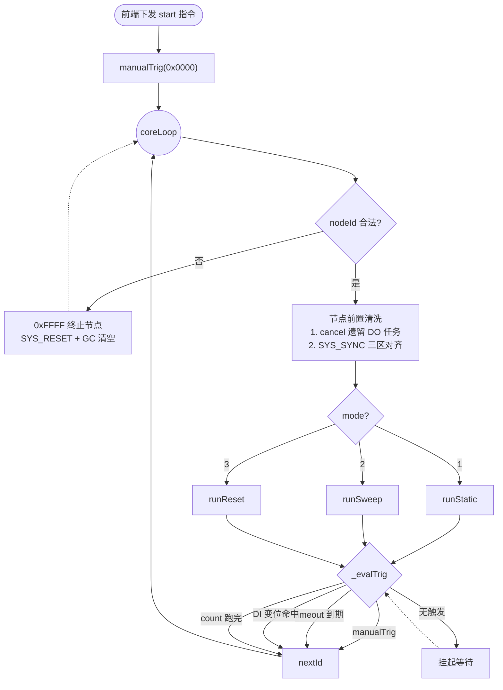
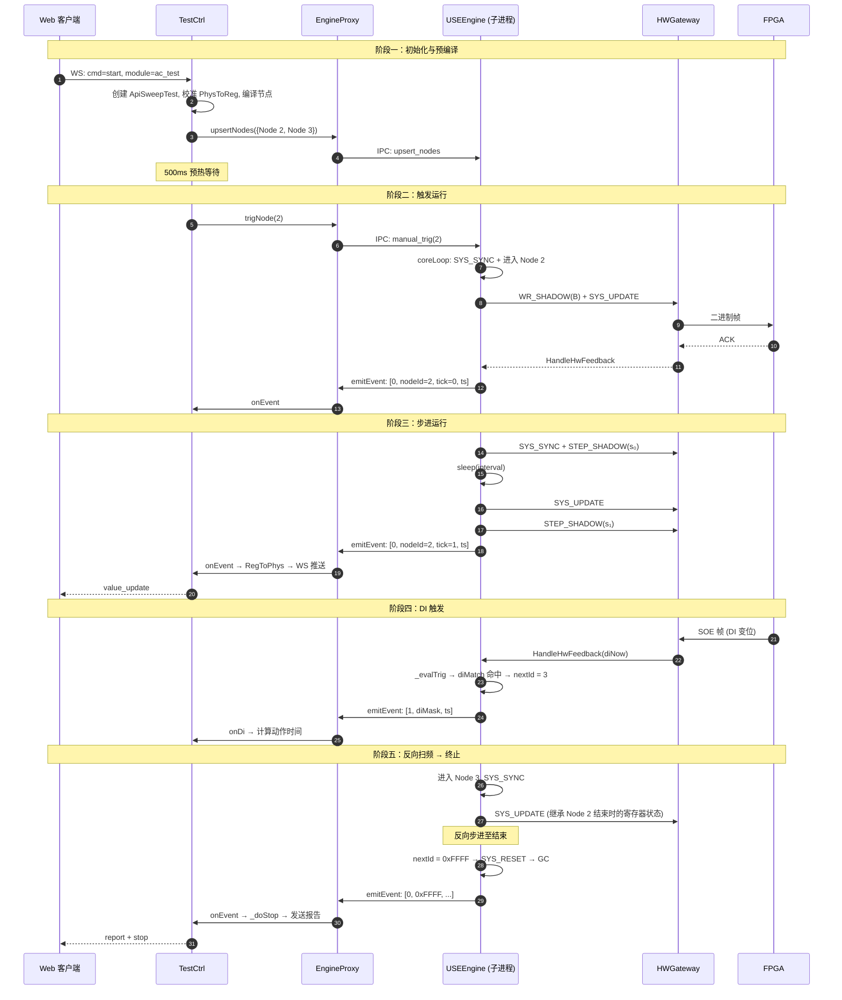

# 系统架构概览

本文档描述 RelayProtection 系统的整体架构、模块职责划分、多进程通信机制，以及 USEEngine 四种波形模式的寄存器级推导。

---

## 1. 系统架构

### 1.1 多进程隔离

系统采用主进程 + 子进程的物理隔离架构，确保硬件控制的实时性不受 WebSocket I/O 和 GC 干扰。

```
┌─────────────────────────────────────────────────┐
│           主进程 (CPU Cores 0, 1, 2)             │
│                                                 │
│  SysEngine.py (入口)                             │
│    ├── WSGateway     (WebSocket 8080)            │
│    ├── TestCtrl      (业务控制 / API 分发)        │
│    ├── EngineProxy   (子进程代理 / 影子状态)      │
│    ├── HWProtect     (GPIO 功放 / 温度保护)       │
│    └── Calibration   (通道校准, 单例)             │
│                                                 │
│         TCP 8081 (pickle 序列化 IPC)              │
│                    ↕                             │
│           子进程 (CPU Core 3)                     │
│                                                 │
│  HwEngineProcess.py                              │
│    ├── USEEngine     (FSM 状态机)                 │
│    └── HWGateway     (串口 /dev/ttyAMA0 230400)  │
│                    ↕                             │
│              FPGA 硬件底座                        │
└─────────────────────────────────────────────────┘
```

- **主进程**：处理外部通信（WebSocket）、测试用例分发、通道校准、温度保护
- **子进程**：独占 Core 3，运行 `USEEngine` 状态机和底层串口收发
- **EngineProxy**：主进程中的代理类，维护节点字典的影子拷贝（Shadow Copy），通过 TCP 8081 与子进程通信。子进程异常退出时由 Linux `prctl(PR_SET_PDEATHSIG)` 自动清理

对应代码：
- [SysEngine.py](file:///home/pi/Desktop/Relay/RelayProtection/SysEngine.py)
- [EngineProxy.py](file:///home/pi/Desktop/Relay/RelayProtection/logic/EngineProxy.py)
- [HwEngineProcess.py](file:///home/pi/Desktop/Relay/RelayProtection/HwEngineProcess.py)

### 1.2 通道映射与校准

全系统使用**物理通道索引 (hwCh)** 作为唯一标识，不使用抽象逻辑通道。

| 类型 | 物理通道 |
|:-----|:---------|
| 电压 (V) | 0, 2, 4, 6, 8, 10 |
| 电流 (I) | 1, 3, 5, 7, 9, 11 |
| 保留 (N) | 12, 13, 14, 15 |

API 层使用 0-15 的连续索引，通过 `HWConfig.MapChannel(api_ch)` 映射到物理通道。

校准采用纯粹的线性模型（[Calibration.py](file:///home/pi/Desktop/Relay/RelayProtection/logic/Calibration.py)）：
- 正向（PhysToReg）：`regValue = amplitude × factor + bias`
- 逆向（RegToPhys）：`amplitude = (regValue - bias) / factor`
- 硬件放大器反相通过 `calibration.json` 中的负数 `factor`（如 `-0.95`）处理，代码对符号完全透明
- 单例模式 `calib = Calibration()` 保证全系统共享

配置文件格式（[calibration.json](file:///home/pi/Desktop/Relay/RelayProtection/config/calibration.json)）：
```json
{ "通道号": [bias, factorDc, factorAc] }
```

---

## 2. 模块职责

### 2.1 TestCtrl（业务控制器）

[TestCtrl.py](file:///home/pi/Desktop/Relay/RelayProtection/logic/TestCtrl.py) 是主进程的核心协调器，职责包括：

- **API 动态加载**：通过 `pkgutil` 扫描 `api/` 目录，按 `MODULE_KEY` 匹配并实例化具体测试类
- **Node 编译**：将 API 层的 `ApiNodeData`（物理参数）编译为 `USENode`（二进制帧），通过 `EngineProxy` 下发子进程
- **Node 0x0000 初始化**（`_initBaseNode`）：预装载 12 通道零偏校准帧，确保开机起振前全通道已加载正确的零偏差。帧序列为：`SYS_RESET` → 12 通道 Layer 0 校准帧 → `SYS_START` → `SYS_SET_DBNC`（防抖帧始终位于末尾）
- **帧合并优化**：`_compileDictToFrames` 将相同参数值的多通道合并为单个 `chMask` 广播帧，最小化通信帧数
- **重入安全**：`_startLock` 防止连续 start 命令导致状态机重叠。若已有测试在运行，先触发 `0xFFFF` 等待安全停止后再启动新测试
- **遥测与上报**：`_handleValueUpdate` 在关键 Tick 节点将寄存器值通过 `RegToPhys` 逆向计算为物理参数，推送给前端。遥测频率限制为 ≥50ms 间隔，防止 WebSocket 拥塞

### 2.2 HWProtect（硬件保护）

[HWProtect.py](file:///home/pi/Desktop/Relay/RelayProtection/logic/HWProtect.py) 负责：

- **GPIO 功放控制**：通过 `gpiozero` 控制 GPIO26（功放使能）和 GPIO20（硬件故障检测）
- **虚拟温度模型**：对电流通道的寄存器幅值进行 I²t 积分，模拟温升。幅度值从 `U32` 右移 16 位后需做 `I16` 有符号校正（`v >= 32768 → v -= 65536`），防止负幅度被错误解读为极大正值导致假性过热保护

> [!NOTE]
> 当前代码中温度监控循环条件为 `while False:`，即监控功能暂时禁用。

### 2.3 WSGateway（WebSocket 网关）

[WSGateway.py](file:///home/pi/Desktop/Relay/RelayProtection/comms/WSGateway.py) 监听 `0.0.0.0:8080`：

- 单客户端模型：新连接会抢占旧连接（支持 F5 快速刷新）
- 发送端使用异步队列 + 批量发送（`_TxWorkerLoop`），每批最多 100 条消息
- 客户端断开时自动触发 `stopTest` 急停

### 2.4 HWGateway（串口网关）

[HWGateway.py](file:///home/pi/Desktop/Relay/RelayProtection/comms/HWGateway.py) 连接 `/dev/ttyAMA0`（230400 波特率）：

- 接收循环以 `0x55` 同步字节对齐，读取 6 字节反馈帧
- 解析为 `(timestamp_u32, status_u16)` 回调 `USEEngine.HandleHwFeedback`
- 支持 `LimitOverrunError` 噪声恢复

---

## 3. 波形模式寄存器级推导

以下使用代数符号：B = 基准参数，R = 复归参数，s₀/s₁/s₂ = 各步增量。

### 3.1 Mode 1: Static

| 节拍 | 下发指令 | Base | Shadow | Active | 说明 |
|:-----|:---------|:-----|:-------|:-------|:-----|
| 写入 | `WR_SHADOW(B)` | B | B | 旧值 | 基准参数写入 Base + Shadow |
| 生效 | `SYS_UPDATE` | B | 旧值 | **B** | 翻转，B 物理输出 |
| 挂起 | `sleepForever` | B | 旧值 | **B** | 等待触发 |

### 3.2 Mode 2: Sweep

| 节拍 | 下发指令 | Base | Shadow | Active | 说明 |
|:-----|:---------|:-----|:-------|:-------|:-----|
| 启动 | `WR_SHADOW(B)` + `UPDATE` | B | 旧值 | **B** | 基准生效 |
| 对齐 | `SYS_SYNC` | **B** | **B** | **B** | 三区对齐，清洗 Shadow 残留 |
| 预载 | `STEP_SHADOW(s₀)` | B+s₀ | **B+s₀** | B | 第一步写入 Shadow |
| Tick 1 | `SYS_UPDATE` | B+s₀ | B | **B+s₀** | 翻转，第一步生效 |
| 预载 | `STEP_SHADOW(s₁)` | B+s₀+s₁ | **B+s₀+s₁** | B+s₀ | 第二步写入 Shadow |
| Tick 2 | `SYS_UPDATE` | B+s₀+s₁ | B+s₀ | **B+s₀+s₁** | 翻转，第二步生效 |

`SYS_SYNC` 在第 0 步确保 Shadow 干净，后续未参与步进的通道在翻转时值不变。

### 3.3 Mode 3: Reset

| 阶段 | 下发指令 | Base | Shadow | Active | 说明 |
|:-----|:---------|:-----|:-------|:-------|:-----|
| 装载 | `WR_SHADOW(F)` + `WR_STAGE(R)` + `UPDATE` | F | F→**R** | 旧值→**R** | 复归 R 生效 |
| 擦洗 | `WR_SHADOW(F)` | F | **F** | **R** | Shadow 重写为故障基准 |
| 故障 | `SYS_UPDATE` | F | R | **F** | 翻转，故障 F 生效 |
| 复归 | `SYS_UPDATE` | F | F | **R** | 翻转回复归 |
| 步进 | `STEP_SHADOW(s₀)` | **F+s₀** | **F+s₀** | R | 在复归期间累加下一步 |
| 故障 | `SYS_UPDATE` | F+s₀ | R | **F+s₀** | 翻转，步进故障生效 |

复归参数 R 在 Active 和 Shadow 之间来回弹跳，不触碰 Base。Base 在幕后进行故障态的步进累加。

### 3.4 Mode 4: DcComp（当前已注释禁用）

| 节拍 | 串口数据 | FPGA 状态 | Active | 说明 |
|:-----|:---------|:----------|:-------|:-----|
| 突发写入 | `B + s₀ + gate₀ + SYNC + s₁` 一次性发出 | FIFO 依次处理 B 和 s₀，遇到 gate₀ | 旧值 | 指令积压在 FIFO 中 |
| FIFO 阻塞 | — | gate₀ 阻塞，目标相位未到 | 旧值 | 后续 SYNC 和 s₁ 被挡住 |
| 相位命中 | — | 硬件自动翻转 | **B+s₀** | 纳秒级精确换相 |
| 泄洪 | — | SYNC 执行，三区对齐 | B+s₀ | 为下一步提供干净锚点 |
| 预载 | — | s₁ 执行，Shadow = B+s₀+s₁ | B+s₀ | 等待下次门控 |

---

## 4. FSM 状态流转



### 典型扫频测试流转（ApiSweepTest）

```
Node 0x0000 (待机)
    │ TestCtrl.startTest → manualTrig(0x0000) → 500ms 预热
    │ → upsertNodes({1?, 2, 3?}) → trigNode(startNode)
    ▼
Node 1 (可选: 前置复归态)
    │ Mode 1 Static, timeoutMs → 超时跳转 Node 2
    ▼
Node 2 (正向扫频)
    │ Mode 2 或 3, 按 stepTime 间隔步进
    ├── DI 变位 → diMatchId = 3 (进入 Node 3 反向) 或 0xFFFF (终止)
    └── count 跑完 → countOverId = 3 (进入 Node 3) 或 0xFFFF (终止)
    ▼
Node 3 (可选: 反向扫频, 仅 changeMode=1)
    │ Mode 2 或 3, 基于 Node 2 结束时的寄存器状态反向步进
    ├── DI 变位（极性反转）→ 0xFFFF 终止
    └── count 跑完 → 0xFFFF 终止
    ▼
Node 0xFFFF (终止)
    │ SYS_RESET → GC 清空 → 发送测试报告
    ▼
Node 0x0000 (回到待机)
```

> [!IMPORTANT]
> 所有节点在 `_preheatAndStart` 阶段一次性预编译并上传，运行期不做动态构建。引擎的节点跳转完全由预定义的 `diMatchId`、`countOverId`、`timeoutId` 驱动，无需上位机干预。

---

## 5. 通信时序（Sweep 模式 DI 触发示例）


